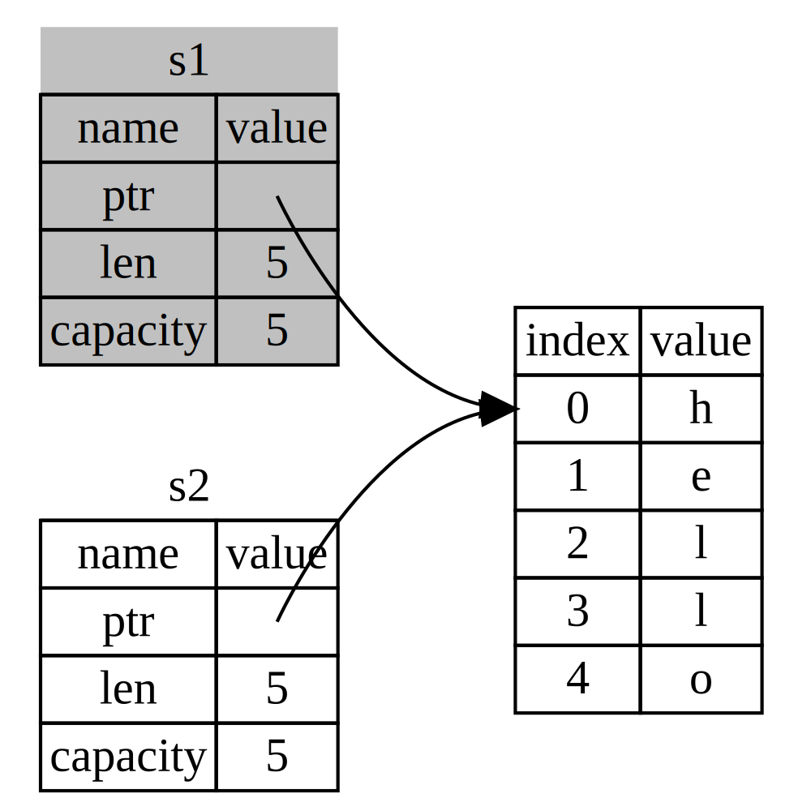

# Ownership

## Stack vs Heap
- Stack
    - fixed sized values
    - strong organized
    - LIFO (last in, first out)
    - fast access
- Heap
    - used for unknown size at compile time 
    - less organized
        - ask OS to find free spot
    - slow access

## Ownership Rules
- Each value in Rust has a variable that’s called its owner.
- There can only be one owner at a time.
- When the owner goes out of scope, the value will be dropped.

## Variable Scope & GC
```rust
{
    let s = String::from("hello"); // s is valid from this point forward

    // do stuff with s

}   // this scope is now over, and s is no longer valid 
    // s.drop() is called automatically at the closing }
```

## Moving simple scalar values
```rust
let x = 5;
let y = x;
println!("{}", y);

// vs

let s1 = String::from("hello");
let s2 = s1;
println!("{}, world!", s1);
```

## Types working with `Copy`
- All the integer types, such as `u32`.
- The Boolean type, `bool`, with values `true` and `false`.
- All the floating point types, such as `f64`.
- The character type, `char`.
- Tuples, but only if they contain types that are also `Copy`. 
    - For example, `(i32, i32)` is `Copy`, but `(i32, String)` is not.

## Moving more complicated types
```rust
let s1 = String::from("hello");
let s2 = s1;
println!("{}, world!", s1);

// vs

let s1 = String::from("hello");
let s2 = s1.clone();
println!("s1 = {}, s2 = {}", s1, s2);
```

## Error Message for moving Strings
```
error[E0382]: use of moved value: `s1`
--> src/main.rs:5:28
  |
3 |     let s2 = s1;
  |         -- value moved here
4 |
5 |     println!("{}, world!", s1);
  | value used here after move ^^
  |
  = note: move occurs because `s1` has type 
    `std::string::String`, which does not implement 
    the `Copy` trait
```

## Moving a string
{ width=50% }

## Borrowing
```rust
fn main() {
    let s1 = String::from("hello");
    let len = calculate_length(&s1);
    println!("The length of '{}' is {}.", s1, len);
}

fn calculate_length(s: &String) -> usize {
    s.len()
}
```

## Mutable References
```rust
fn main() {
    let mut s = String::from("hello");
    change(&mut s);
    println!("{}", s);
}

fn change(some_string: &mut String) {
    some_string.push_str(", from 06");
}
```

## Single mutable reference
```rust
fn main() {
    let mut s = String::from("hello");
    let r1 = &mut s;
    let r2 = &mut s;
}
```